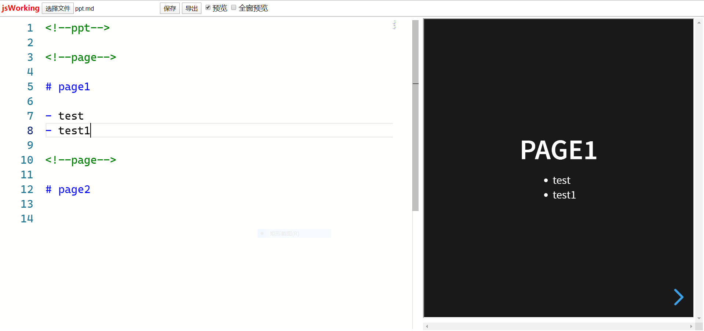
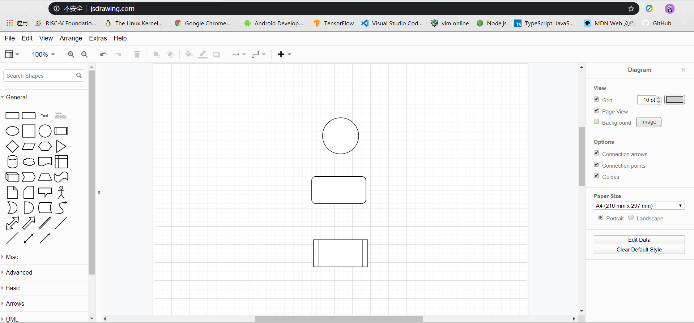

# jsWorking

jsWorking是一款基于Web的用markdown编写html格式的doc和ppt的单文档工具,支持程序语法高亮，数学公式，结构图和统计图，可下载到本地使用，也可在线使用。

## 1.主要特性

- Markdown编写DOC
- Markdown编写PPT
- Latex方式编写公式
- 程序语法高亮显示
- 实时预览编写效果
- 本地打开与保存
- 导出HTML文件
- 自动暂存数据
- 画结构图
- 画统计图
- PDF阅读

## 2.使用说明

Markdown是一种用标识符编写固定文档格式的语言，对HTML的更进一步的精简，简单易用。

### 2.1 标题

用\#个数表示标题级别，对应HTML的h1~h6标签。

语法：

> \# 标题 

示例：

> \# 一级标题h1

> \#\# 二级标题h2

> \#\#\# 三级标题h3

> \#\#\#\# 四级标题h4

> \#\#\#\#\# 五级标题h5

> \#\#\#\#\#\# 六级标题h6


效果：

# 一级标题h1

## 二级标题h2

### 三级标题h3

#### 四级标题h4

##### 五级标题h5

###### 六级标题h6


### 2.2 字体

用*表示加粗，斜体，斜体加粗

语法：

> \*斜体\*  
> \*\*加粗\*\*  
> \*\*\*斜体加粗\*\*\*

效果：

*斜体*   
**加粗**  
***斜体加粗***


### 2.3 引用

用\>表示引用，多个\>表示多层引用。

语法：

> \> 引用  
> \>\> 引用

效果：

> 引用  
>> 引用  

### 2.4 无序列表

用\-表示无序列表,子项-前需要3个以上空格，对应HTML的ul>li标签。

语法：

> \- 项目

示例：

> \- 项目1

> \- 项目2

> \- 项目3

> &nbsp;&nbsp;&nbsp;\- 子项1

> &nbsp;&nbsp;&nbsp;\- 子项2

> &nbsp;&nbsp;&nbsp;\- 子项3

效果：

- 项目1
- 项目2
- 项目3
   - 子项1
   - 子项2
   - 子项3


### 2.5 图片

用\!\[\]()符号插入图片，对应HTML中img标签。

语法：

> \!\[替代文字\](网址)

示例：

> \!\[logo\](http://algorithm.jscoding.net/img/logo.svg)

效果：


### 2.6 超链接

用\[\]()表示超链接

语法：

> \[链接信息\](网址)

示例：

> \[jsWorking\](http://www.jsworking.com.cn/)

效果：

[jsWorking](http://www.jsworking.com.cn/)

### 2.7 程序

用\`\`\`表示程序代码，支持指定语言的语法高亮，带行号。

语法：

> \`\`\`语言

> 代码块

> \`\`\`

示例：

> \`\`\`javascript

> console.log("a");

> console.log("b");

> console.log("c");

> \`\`\`

效果：

```javascript
console.log("a");
console.log("b");
console.log("c");
```

### 2.8 表格

用|表示制表符，用\-分隔表头与数据，用:表示对齐方式。

示例：

> |项目1|项目2|项目3|

> |:--| --:|:--:|

> |1|2|3|

效果：

|项目1|项目2|项目3|
|:--| --:|:--:|
|左|右|中|

### 2.9 公式

采用Mathjax渲染Web公式。分行内和块公式两种。

#### 行内公式

用单个$括起来的公式表示行内公式。

语法：

> \\$...\\$

示例：

> \\$ f=ma \\$

效果:

$f=ma$

#### 块公式

用两个$$括起来的公式表示行内公式。

语法：

> \\$\\$...\\$\\$

示例：

> \\$\\$ F= \frac{GMm}{r^2}\\$\\$

效果：

$$ F= \frac{GMm}{r^2}$$

### 2.10 编写PPT

- 最开始位置要输入一行<!--ppt-->表示PPT。
- 每一页PPT前输入一行<!--page-->表示一页。

示例：

> <!--ppt-->

>

> <!--page-->

> \# page1

> <!--page-->

> \# page2

效果：




### 2.11 画结构图



### 2.12 画统计图


